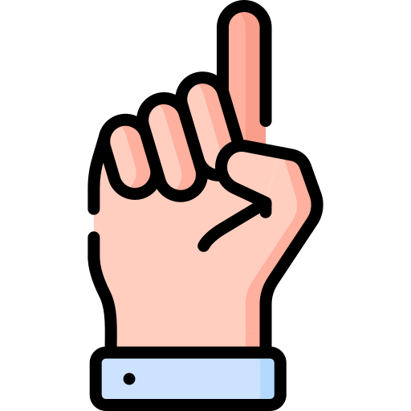
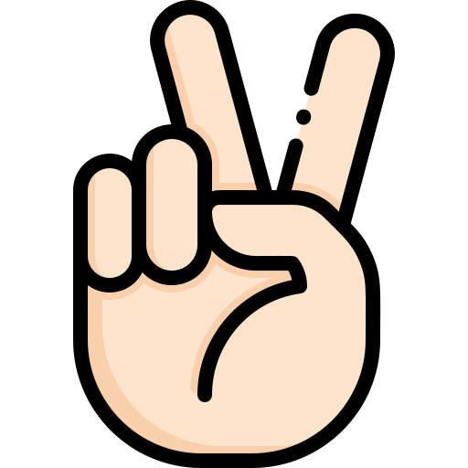
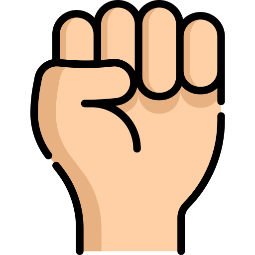
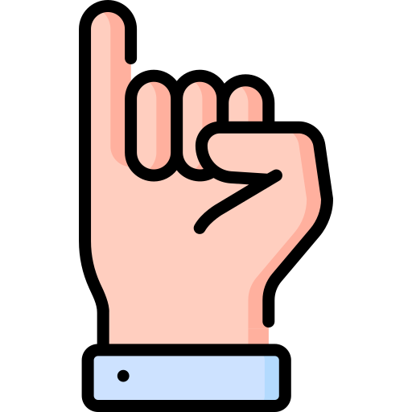

## Virtual Mouse Controled by Hand Gestures

Control your mouse only with your hand gestures!!!

https://github.com/Irash-Perera/VirtualFingerMouse/assets/42272743/b56d8878-233b-436f-b9fc-70509879255c

### Description

This project is a virtual mouse that can be controlled by hand gestures. The hand gestures are detected by a camera and the mouse is controlled by the hand movements. The project is implemented using OpenCV and MediaPipe.

### Detecting Hand Gestures

These are the hand gestures and the corresponding actions that can be performed using the virtual mouse.

| Hand Gesture | Action |
| ------------ | ------ |
|  | Move the mouse pointer |
|  | Click the left mouse button |
|  | Click the right mouse button |
|  | Scroll up |
|  | Scroll down |
|  | Terminate the program |


### Getting Started

#### 1. Clone the repository
Clone the repository to your local machine using the following command.

```
git clone https://github.com/Irash-Perera/VirtualFingerMouse.git
```
#### 2. Install the required libraries
Install the required libraries using the following command.

```
pip install -r requirements.txt
```
#### 3. Run the program

Hit the run button on `virtual_mouse.py` file to run the program.

Note: Make sure that the camera is connected to the computer. Also if you are not using the default camera, change the camera index in the `cv2.VideoCapture()` function in the `virtual_mouse.py` file.

Enjoy!!! 😁


